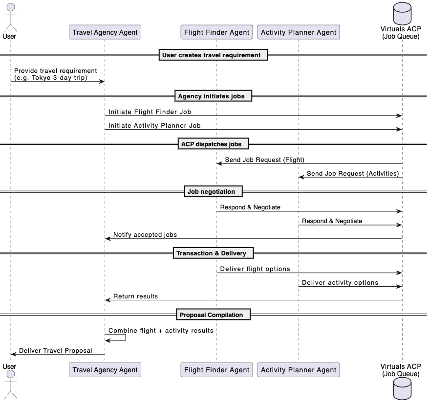

# Virtuals ACP Multi-Agent Coordination Demo

📗 Example Use Case: Travel Agency

Autonomous AI Agents collaborating to plan travel, powered by **Virtuals ACP** & **GAME SDK**.  
This demo showcases how multiple AI Agents (Flight Finder, Activity Planner, and a Travel Agency Orchestrator) can autonomously negotiate, execute, and deliver travel-related services using blockchain-based job contracts.

To better understand how the agents interact, here are two visual references:

### Full Workflow Diagram


### Simplified Agent Relationships


---

## Features

- **Activity Planner Agent**  
  - Finds local activities and events using Google Search API.
- **Flight Finder Agent**  
  - Searches and delivers flight options using Amadeus Flight API.
- **Virtual Travel Agency Agent**  
  - Orchestrates workflow between multiple agents.  
  - Initiates flight & activity jobs.  
  - Combines results into cohesive travel proposals.  
  - Demonstrates automated negotiation and payment workflows.

---

## How It Works

1. **Job Handling via ACP**  
   - Agents listen for new jobs from the Virtuals ACP network.  
   - Jobs are processed according to their phase: **Request → Negotiation → Transaction → Evaluation**.  
   - Each agent autonomously decides whether to accept jobs and deliver results.

2. **Orchestration**  
   - The Travel Agency Agent initiates sub-jobs to Flight Finder & Activity Planner.  
   - Results are compiled into a single travel proposal.

3. **Persistence**  
   - Job states are saved locally in `job_state.json` for continuity between runs.


---

## Technology Stack

- **Virtuals ACP SDK** – agent job handling
- **Game SDK Agent Framework** – multi-agent orchestration
- **Google Search API (SerpAPI)** – activity data
- **Amadeus API** – flight data
- **Rich** – CLI visualization

---

## Setup

### 1. Prerequisites
- Python 3.9+  
- (Optional) Virtual environment:
  ```bash
  python -m venv venv
  source venv/bin/activate      # macOS/Linux
  venv\Scripts\activate         # Windows

---

## Important Resources

Here are some useful references to help you get started quickly:

1. **ACP Quick Start Guide (Builder Cheatsheet):** [**Link 🔗**](https://www.notion.so/Hackathon-Cheatsheet-2342d2a429e98061aa22f2d0e389abd1?pvs=21)  
2. **ACP Technical Playbook:** [**Link 🔗**](https://app.gitbook.com/o/OefuIv32WG440h2tS5N0/s/rrll8DWDA3BJwEBqOtxm/info-hub/builders-hub/agent-commerce-protocol-acp-builder-guide/acp-tech-playbook)  
3. **ACP SDK (Node.js version):** [**Link 🔗**](https://github.com/Virtual-Protocol/acp-node/tree/main)  
4. **ACP SDK (Python version):** [**Link 🔗**](https://github.com/Virtual-Protocol/acp-python/tree/main)  
5. **Virtuals Official Website (Frequently Asked by Participants):** [**Link 🔗**](https://app.virtuals.io/)  
6. **Virtuals Whitepaper:** [**Link 🔗**](https://whitepaper.virtuals.io/)

---

## Stay Connected

Stay in touch after the event and keep up with the latest updates:

- **Follow us on X (Twitter):** [https://x.com/virtuals_io](https://x.com/virtuals_io) – for the latest news and announcements  
- **Join our Discord:** [https://discord.gg/WjcSM48Fyd](https://discord.gg/WjcSM48Fyd) – direct access to tech support and community chat  
- **Chat with us on Telegram:** [https://t.me/virtuals](https://t.me/virtuals) – for casual conversation and networking

